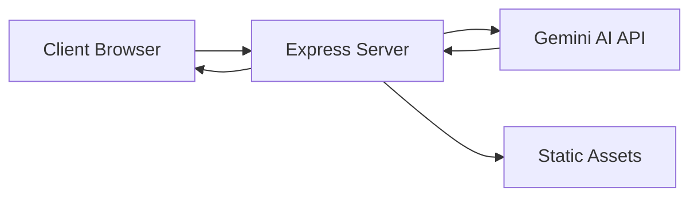

# 🇮🇳 VoterBuddy India: Indian Election Assistant


[](https://nodejs.org/)
[](https://opensource.org/licenses/ISC)
[](https://election-assistant-325019738133.us-central1.run.app)
[](https://deepmind.google/technologies/gemini/)

**VoterBuddy India** is a premium, interactive web application designed to empower Indian citizens with knowledge about their democratic rights and the electoral process. Built with a sophisticated dark-mode UI and powered by cutting-edge AI, it transforms civic education into an engaging digital experience.

---

## 🚀 Experience It Live
**[Visit VoterBuddy India](https://election-assistant-325019738133.us-central1.run.app)**

---

## ✨ Core Features

### 📖 1. Interactive Election Guide
A comprehensive, step-by-step timeline that demystifies the voting journey. From initial registration via **Form 6** to the final mark on your finger at the polling station, every stage is explained clearly.

### 📇 2. 3D Interactive Flashcards
Learning terminology doesn't have to be boring. Use our **3D flipping cards** to master essential concepts like:
- **VVPAT** (Voter Verifiable Paper Audit Trail)
- **NOTA** (None of the Above)
- **Model Code of Conduct**
- **EPIC Card** details

### 📝 3. Knowledge Quiz
Put your democratic knowledge to the test!
- **Real-time Feedback**: Instant results after every question.
- **In-depth Explanations**: Learn why an answer is correct.
- **Score Analytics**: Track your progress and share your results.

### 🤖 4. AI-Powered Chat Assistant
Have a specific question? Ask **VoterBuddy AI**. Powered by **Google Gemini**, our assistant provides accurate, context-aware answers regarding voter eligibility, registration procedures, and polling booth protocols.

---

## 🛠️ Technology Stack

| Layer | Technologies |
| :--- | :--- |
| **Frontend** | Vanilla JS (ES6+), CSS3 Glassmorphism, HTML5, FontAwesome |
| **Backend** | Node.js, Express.js |
| **AI Intelligence** | Google Gemini API (`@google/genai`) |
| **Infrastructure** | Docker, Google Cloud Run |
| **Design** | Google Fonts (Outfit, Inter), Responsive Web Design |

---

## 🏗️ Architecture Overview



---

## 💻 Getting Started

### Prerequisites
- **Node.js** (v18 or higher)
- **npm** (comes with Node)
- **Google Gemini API Key** ([Get one here](https://aistudio.google.com/app/apikey))

### Installation & Setup

1. **Clone the Repository**
   ```bash
   git clone https://github.com/jaiveerverma50989-dot/promotwar1.git
   cd promotwar1
   ```

2. **Install Dependencies**
   ```bash
   npm install
   ```

3. **Configure Environment**
   Create a `.env` file in the root directory:
   ```env
   GEMINI_API_KEY=your_actual_api_key_here
   PORT=8080
   ```

4. **Launch Local Server**
   ```bash
   npm start
   ```
   Open [http://localhost:8080](http://localhost:8080) in your browser.

---

## ☁️ Deployment

This project is optimized for **Google Cloud Run**.

1. **Build Container**
   ```bash
   docker build -t gcr.io/[PROJECT_ID]/voterbuddy .
   ```

2. **Deploy to Cloud Run**
   ```bash
   gcloud run deploy voterbuddy --image gcr.io/[PROJECT_ID]/voterbuddy --platform managed
   ```

*Alternatively, use the provided `deploy.sh` script.*

---

## 📂 Project Structure

```text
.
├── assets/             # Project images and logos
├── data.js             # Static data for Guide, Flashcards, and Quiz
├── index.html          # Main application structure
├── script.js           # Frontend logic and AI interaction
├── server.js           # Node/Express backend
├── styles.css          # Premium Glassmorphism styling
├── Dockerfile          # Container configuration
└── README.md           # This document
```

---

## 📄 License & Disclaimer

- **License**: Distributed under the ISC License.
- **Disclaimer**: This application is for educational purposes. All information is sourced from official guidelines provided by the **Election Commission of India (ECI)**. Always refer to official government portals for the most up-to-date legal requirements.

---

<p align="center">
  Made with ❤️ for Indian Democracy
</p>

