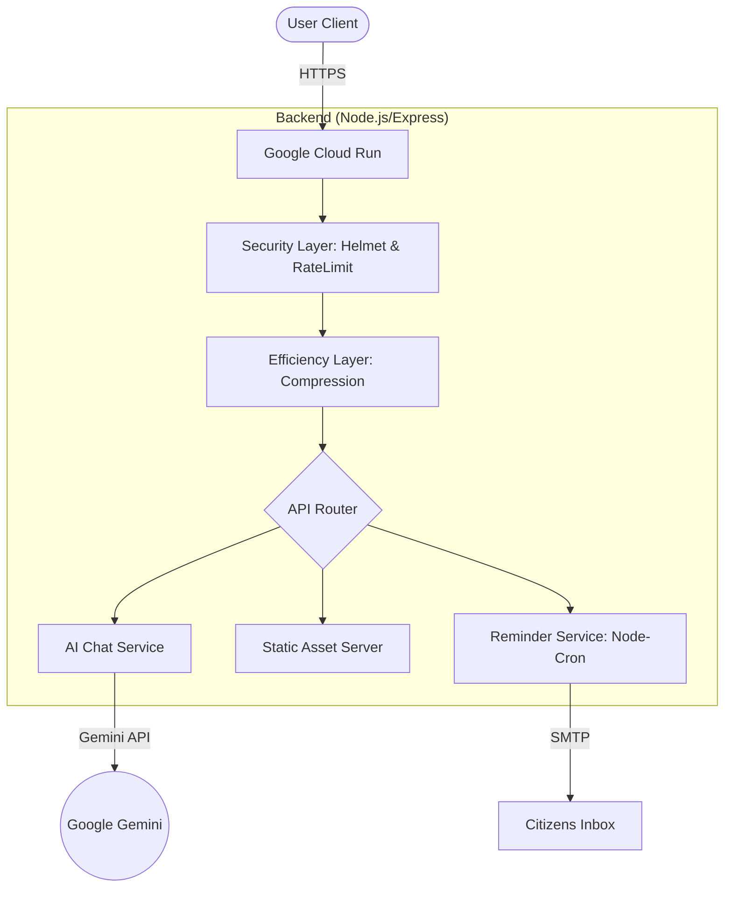

# 🇮🇳 VoterBuddy India: Indian Election Assistant


[](https://nodejs.org/)
[](https://jestjs.io/)
[](https://helmetjs.github.io/)
[](https://election-assistant-325019738133.us-central1.run.app)

**VoterBuddy India** is a premium, interactive web application designed to empower Indian citizens with knowledge about their democratic rights and the electoral process. It transforms complex civic information into an engaging, accessible, and secure digital experience.

---

## 🚀 Experience It Live
**[Visit VoterBuddy India](https://election-assistant-325019738133.us-central1.run.app)**

---

## ✨ Core Features

### 📖 1. Interactive Election Guide
A comprehensive, step-by-step timeline demystifying the voting journey. From registration via **Form 6** to casting the vote, every stage is detailed with clarity.

### 📇 2. 3D Interactive Flashcards
Master essential concepts like **VVPAT**, **NOTA**, and the **Model Code of Conduct** using immersive 3D flipping cards.

### 📝 3. Knowledge Quiz
Test your democratic literacy with real-time feedback, in-depth explanations, and visual score analytics.

### 🤖 4. AI-Powered Chat Assistant
Ask **VoterBuddy AI** anything. Powered by **Google Gemini**, it provides accurate answers regarding eligibility, registration, and protocols.

### 🔔 5. Weekly Reminders
Integrated email system to keep citizens informed about upcoming deadlines and civic responsibilities.

---

## 🏗️ Architecture Overview



---

## 🛡️ Security & Performance
- **Security**: Hardened with `Helmet` (CSP, HSTS) and `Express-Rate-Limit` to prevent abuse.
- **Efficiency**: Response `Compression` and static asset caching enabled for lightning-fast loads.
- **Accessibility**: ARIA-compliant structure with high-contrast UI and keyboard navigation support.

---

## 🧪 Testing System
The project includes a robust automated testing suite to ensure reliability:
- **Backend Tests**: API integration tests using `Supertest`.
- **Frontend Tests**: Logical unit tests using `JSDOM`.
- **Mocking**: Reliable testing with mocked AI responses and browser globals.

To run tests:
```bash
npm test
```

---

## 🛠️ Technology Stack

| Layer | Technologies |
| :--- | :--- |
| **Frontend** | Vanilla JS (ES6+), CSS3 Glassmorphism, HTML5 (ARIA Compliant) |
| **Backend** | Node.js, Express.js (Helmet & Compression optimized) |
| **AI Intelligence** | Google Gemini API (`@google/genai`) |
| **Testing** | Jest, Supertest, JSDOM |
| **Infrastructure** | Docker, Google Cloud Run |

---

## 📂 Project Structure
```text
.
├── server.js           # Secure & Optimized Express Backend
├── script.js           # Interactive Frontend Logic
├── data.js             # Election Knowledge Base
├── server.test.js      # Backend Integration Tests
├── frontend.test.js    # Frontend Logic Tests
├── index.html          # Accessible UI Structure
├── styles.css          # Premium Design System
└── deploy.sh           # Automated Cloud Deployment
```

---

<p align="center">
  Made with ❤️ for Indian Democracy | 🇮🇳 Every Vote Counts
</p>
